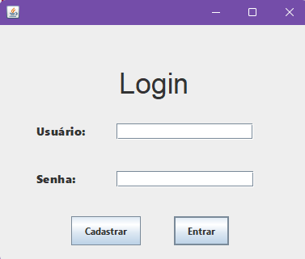
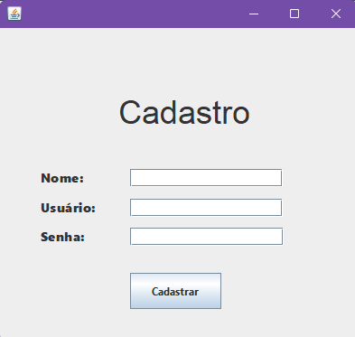
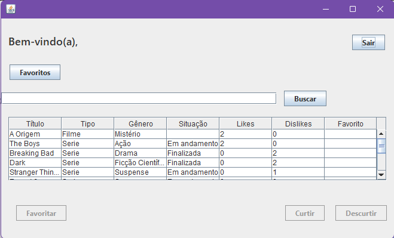
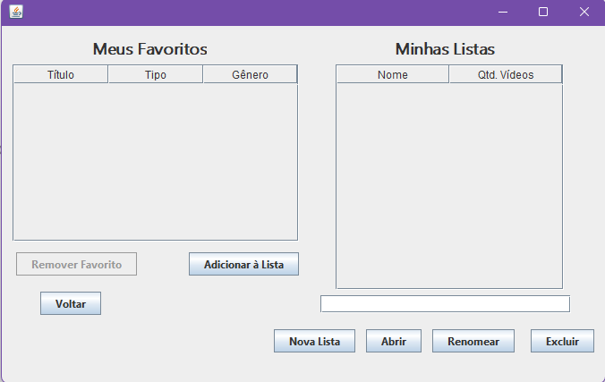

# Java Streaming


---

# 💻 Sobre o Projeto

O **Java Streaming** é uma aplicação desktop desenvolvida em Java utilizando Java Swing, arquitetura MVC e persistência em PostgreSQL.

O sistema simula uma plataforma de streaming, permitindo:

- autenticação de usuários;
- cadastro de contas;
- busca dinâmica de vídeos;
- sistema de likes e dislikes;
- gerenciamento de favoritos;
- criação de playlists personalizadas.

O projeto foi desenvolvido com foco em:

- Programação Orientada a Objetos;
- separação de responsabilidades;
- modelagem UML;
- persistência relacional;
- interação entre Java e banco de dados PostgreSQL.

---

# 🚀 Funcionalidades

✔ Cadastro de usuários  
✔ Login integrado ao PostgreSQL  
✔ Busca dinâmica de vídeos  
✔ Sistema de likes e dislikes  
✔ Sistema de favoritos  
✔ Criação e gerenciamento de playlists  
✔ Adição e remoção de vídeos em playlists  
✔ Controle individual de reações por usuário  
✔ Interface gráfica com JTable interativa  

---

# 🧠 Conceitos Aplicados

Durante o desenvolvimento foram aplicados conceitos importantes de:

- Programação Orientada a Objetos;
- Herança;
- Polimorfismo;
- Classes Abstratas;
- Interfaces;
- Arquitetura MVC;
- DAO (Data Access Object);
- Modelagem Relacional;
- SQL com PostgreSQL.

---

# 🏗 Arquitetura do Sistema

O sistema foi estruturado em camadas seguindo o padrão MVC.

| Camada | Responsabilidade |
| :--- | :--- |
| **Model** | Representação das entidades do sistema |
| **View** | Interface gráfica em Java Swing |
| **Controller** | Regras de negócio e controle da interface |
| **DAO** | Persistência e comunicação com PostgreSQL |

---

# 🎬 Sistema de Vídeos

O sistema utiliza uma classe abstrata `Video`, responsável por representar características comuns entre filmes e séries.

As subclasses:

- `Films`
- `Series`

especializam o comportamento de cada tipo de conteúdo utilizando herança e polimorfismo.

A classe `Series` também implementa a interface `Situation`, responsável por representar o estado da série, como:

- Em andamento
- Finalizada

---

# ❤️ Sistema de Reações

O sistema de reações foi inspirado em plataformas reais como YouTube.

Cada usuário pode:

- curtir;
- descurtir;
- remover reação;
- alternar entre like e dislike.

O controle é realizado através de:

- restrição única no banco;
- consultas SQL com `ON CONFLICT`;
- lógica de alternância implementada nos DAOs.

Isso garante que:

✔ um usuário tenha apenas uma reação por vídeo;  
✔ não seja possível possuir like e dislike simultaneamente.  

---

# 📂 Sistema de Playlists

O sistema permite que cada usuário crie playlists personalizadas e organize vídeos.

A modelagem foi construída utilizando:

- relacionamento entre usuários e playlists;
- tabela intermediária para vídeos da playlist;
- controle de posição dos vídeos.

A estrutura orientada a objetos foi representada pela classe `Playlist`, contendo:

- usuário proprietário;
- coleção de vídeos (`ArrayList<Video>`).

---

# 🗄 Banco de Dados

O PostgreSQL foi utilizado para persistência dos dados da aplicação.

O sistema utiliza tabelas relacionais para:

- usuários;
- vídeos;
- favoritos;
- reações;
- playlists;
- associação entre playlists e vídeos.

Além disso, foram utilizados:

- JOINs;
- GROUP BY;
- ORDER BY;
- COUNT;
- subconsultas;
- restrições UNIQUE.

---

# 📸 Tour pelo Sistema

## 🔐 Tela de Login

Sistema de autenticação integrado ao PostgreSQL.

<div align="center">
  
</div>

<br>

---

## 📝 Cadastro de Usuários

Tela responsável pelo cadastro de novos usuários com validação de campos obrigatórios.

<div align="center">
  
</div>

<br>

---

## 🏠 Home do Sistema

Tela principal contendo:

- busca dinâmica;
- tabela interativa;
- likes/dislikes;
- favoritos.

<div align="center">
  
</div>

<br>

---

## ❤️ Favoritos e Playlists

Gerenciamento completo de favoritos e listas personalizadas.

<div align="center">
  
</div>

<br>

---

# 🛠 Tecnologias Utilizadas

| Categoria | Tecnologias |
| :--- | :--- |
| **Linguagem** | Java 17 |
| **Interface Gráfica** | Java Swing |
| **Banco de Dados** | PostgreSQL |
| **Arquitetura** | MVC + DAO |
| **Paradigma** | Programação Orientada a Objetos |
| **IDE** | Apache NetBeans |
| **Controle de Versão** | Git + GitHub |

---

# ⚡ Desafios do Projeto

Durante o desenvolvimento, alguns dos principais desafios enfrentados foram:

- Estruturar corretamente a arquitetura MVC separando responsabilidades entre View, Controller, DAO e Model.
- Integrar Java Swing com persistência PostgreSQL utilizando JDBC.
- Modelar relacionamentos relacionais entre usuários, vídeos e playlists.
- Implementar sistema de reações inspirado em plataformas reais.
- Controlar favoritos e playlists utilizando tabelas intermediárias.
- Aplicar conceitos de Programação Orientada a Objetos na estrutura do sistema.
- Organizar a navegação entre telas mantendo a separação de responsabilidades.

---

# 📚 Aprendizados

O projeto proporcionou experiência prática em:

- arquitetura MVC;
- persistência com PostgreSQL;
- modelagem relacional;
- Java Swing;
- orientação a objetos;
- estruturação de sistemas desktop.

Além disso, o desenvolvimento reforçou conceitos importantes de organização de código, separação de camadas e manutenção de software.

---

# ▶ Como Executar

## Pré-requisitos

- Java 17
- PostgreSQL
- Apache NetBeans

---

## Passos

1. Clone o repositório:

```bash
git clone https://github.com/seuusuario/java-streaming.git
```

2. Configure o banco PostgreSQL.

3. Execute os scripts SQL do projeto.

4. Abra o projeto no NetBeans.

5. Execute a aplicação.

---

# 👨‍💻 Autor

Ricardo Ferreira

LinkedIn:  
https://www.linkedin.com/in/ricardo-ferreira-8b5145371

Email:  
rasf0831@gmail.com